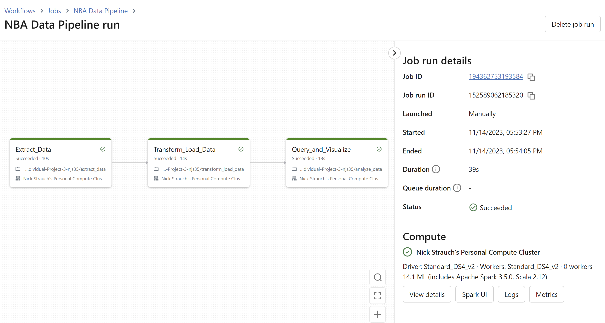
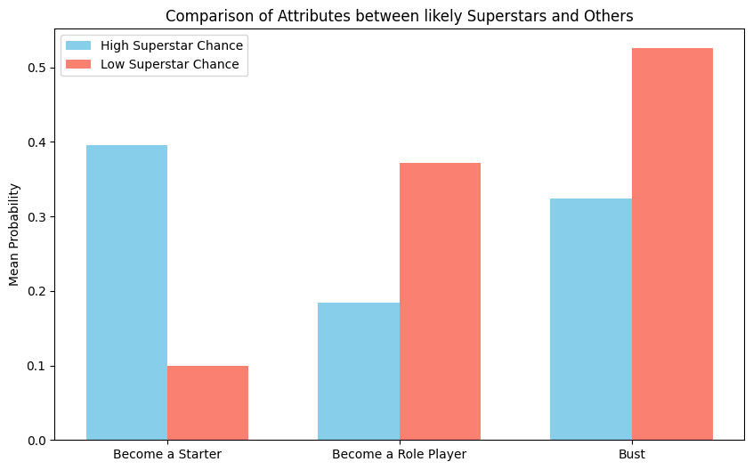

# Databricks ETL Pipeline

## Project Overview
The Databricks pipeline created in the project extracts, transforms, and a [2015 NBA draft dataset](https://github.com/fivethirtyeight/data/raw/master/nba-draft-2015/historical_projections.csv). The pipeline takes advantage of Delta Lake's unique capabilities such as metadata management and ACID transactions. Addtionally, this pipeline can be automatically triggered via the Databricks api. The CI process for this project's repository will trigger a pipeline run on a push to the main branch.

### Unique Capabilities of Delta Lake
#### Time Travel
Delta Lake provides time travel functionality, allowing users to query the history of the data. This is particularly useful for auditing, debugging, and recovering from errors. This project's pipeline takes advantage of time travel to track changes made to the dataset over time, enabling easy rollback to a specific version if necessary.
#### Metadata Management
Delta Lake maintains rich metadata, which includes information about the schema of the table, data statistics, and data lineage. This metadata is valuable for understanding the dataset's evolution and making informed decisions about data transformations. This pipeline leverages metadata management to gain insights into the dataset's structure and characteristics.
#### ACID Transactions
Delta Lake supports ACID (Atomicity, Consistency, Isolation, Durability) transactions, ensuring data integrity and consistency. The pipeline relies on ACID transactions to guarantee that each operation on the dataset is atomic and that the data is always in a consistent state. This is crucial for maintaining the quality and reliability of the dataset, especially when working with others.

### Data Validation Checks
The notebook incorporates data validation checks using Delta Lake to enhance the overall data quality. These checks are performed before the data analysis phase and focus on identifying incomplete rows and inconsistent schemas.

#### Missing Data 
This project's data pipeline checks for incomplete rows to identify and handle missing or null values in the dataset. By leveraging Delta Lake's capabilities, the pipeline can efficiently identify and address incomplete rows, ensuring that the data used for analysis is complete and accurate.

## Pipeline Overview

1. `Extract` the NBA csv data via the python requests library. This data is saved in the Databricks File System (DBFS).

2. `Transform` the csv file into a spark dataframe. Split the spark dataframe into two parts: One part representing players with a high superstar potential, and the remaining players in the other.

3. `Load` the spark dataframes into two Delta Lake tables. Utilize the Delta Lake functionalities to verify data quality.

4. `Analyze` the two Delta Lake tables via SQL queries.

5. `Visualize` the differences between the Superstar and Other tables.

## Running the Pipeline

### Preparation
1. Create a Databricks workspace
2. Create a cluster that can support PySpark (I reccomend a minimum of 8 cores).
3. Clone this GitHub repository into the workspace.
4. Create a job on Databricks workflows with the following tasks:
    - Extract: databricks-tasks/extract.py
    - Transform and Load Task (Data Sink): databricks-tasks/transform-load.py
    - Query and Analyzek: databricks-tasks/query_and_analyze.py

### Trigger the Pipeline
The pipeline is setup to automatically trigger on a push to the main branch of the GitHub repository. This is accomplished via the Databricks api and the `main.py` script. There is also a scheduled run set for 1pm every Tuesday. 

# Pipeline Output Analysis

## NBA Data Analysis

### Recommendations Based off Data
The visualizations presented above provide compelling insights into the effectiveness of the Superstar prediction feature for predicting player success in the NBA. The analysis suggests a strong correlation between the predicted superstar status and other performance metrics. Overall, the Superstar prediction feature offers a practical tool for NBA teams to enhance player scouting decisions and optimize team composition, providing valuable insights into potential player success

### Conclusion
The Databricks ETL pipeline for the 2015 NBA draft dataset demonstrates an effective integration of Delta Lake's unique capabilities, including time travel, metadata management, and ACID transactions. Leveraging these features, the pipeline ensures robust data integrity, consistency, and traceability throughout its execution. The inclusion of automated triggers through the Databricks API and CI processes further enhances the project's efficiency and reliability. The data validation checks, focusing on identifying incomplete rows and inconsistent schemas, contribute to the overall quality of the dataset. 